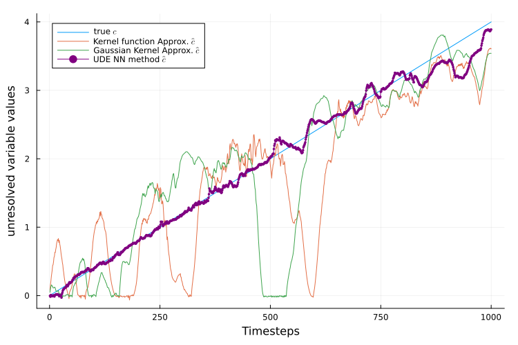
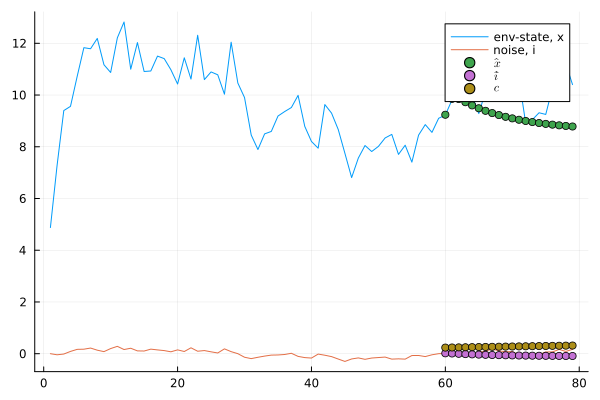
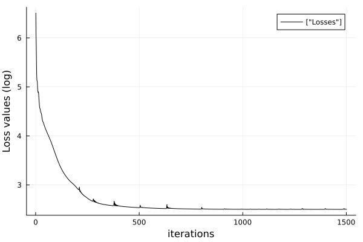

# C_Star
Predicting critical transition values of harvest rate using SCiML

Results-01: Predicted values of missing term using out approach; comparison with Kernel function approximation, Bayesian Kernel estimation.

Results-02: Forecasting values for species abundance.

Training loss:

