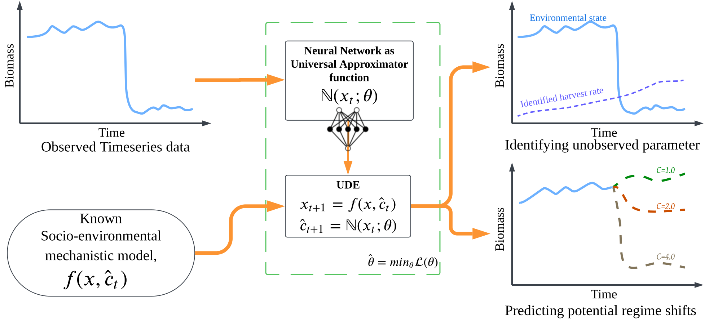

# Predicting unobserved driver of regime shifts in social-ecological systems with universal dynamic equations

## Abstract
Ecosystems around the world are anticipated to undergo regime shifts as temperatures rise and other climatic and anthropogenic perturbations erode the resilience of present-day states. Forecasting these nonlinear ecosystem dynamics can help stakeholders to prepare for the associated rapid changes. One major challenge is that regime shifts can be difficult to predict when they are driven by unobserved factors. In this paper, we advance scientific machine learning methods, specifically universal dynamic equations (UDEs), to identify changes in an unobserved bifurcation parameter and predict ecosystem regime shifts. We demonstrate this approach using simulated data created from a dynamic model of a species population experiencing loss due to unobserved extraction or harvest. This could be, for example, illegal fishing from a fishery or unreported poaching in a game reserve. We show that UDEs can accurately identify changes in the unobserved bifurcation parameter, in our case the slowly increasing harvest rate, and predict when a regime shift might occur. Compared to alternative forecasting methods, our UDE approach provides more reliable short-term predictions with fewer data. This approach provides a new set of methods for ecosystem stakeholders and managers to identify unobserved changes in key parameters that drive nonlinear change.

## Overview
C_Star provides the supporting code for the paper *Predicting Regime Shifts in Social-Ecological Systems Using Scientific Machine Learning*. The research applies Universal Differential Equations (UDEs) to identify unobserved bifurcation parameters, specifically harvest rate, and forecast critical regime shifts in ecological systems. This methodology enhances predictive accuracy compared to traditional early warning indicators.



## Features
- **Scientific Machine Learning (SciML) Methods**: Implements UDEs for identifying unobserved parameter affecting regime shifts.
- **Forecasting Ecosystem Dynamics**: Uses simulated data to predict critical transition points.
- **Comparative Analysis**: Evaluates UDE performance against Bayesian and Kernel function approaches.

## Repository Structure
```
├── .vscode/                # Configuration files
├── UDE_activations/        # Evaluating Activation functions used in modeling
├── csv/                    # Data files
├── env/                    # Environment settings
├── notebooks/              # Jupyter notebooks for analysis
├── plots/                  # Visualization outputs
├── scripts/                # Julia scripts for training models
├── .gitignore              # Git configuration
├── LICENSE                 # Project license
├── README.md               # Project documentation
```

## Getting Started
### Installation
1. Clone the repository:
   ```sh
   git clone https://github.com/kjrathore/C_Star.git
   ```
2. Navigate to the project directory:
   ```sh
   cd C_Star
   ```
3. Activate env in Julia and instantiate packages:
   ```sh
   julia --project=env
   or 
   julia
   ]
   activate env
   ```

### Usage
- Execute scripts in the `scripts/` directory for specific model training tasks.
- Run analysis notebooks to explore forecasting methodologies.
- View plots in the `plots/` directory for visualizing model predictions.

## Results
### Identifying Unobserved Parameters
UDEs are employed to track gradual changes in harvest rate, a key bifurcation parameter affecting population dynamics.

### Forecasting Regime Shifts
Compared to traditional warning indicators, the SciML approach provides more accurate and lower-uncertainty predictions.

### Performance Evaluation
The model’s forecasting ability is assessed against benchmark techniques such as Kernel function approximation and Bayesian Kernel estimation.

## License
This project is licensed under the **MIT License** – see the [LICENSE](LICENSE) file for details.

## Contributors
- **Kunal J. Rathore**
- **John H. Buckner**
- **Zechariah D. Meunier**
- **Jorge Arroyo Esquivel**
- **James R. Watson**

## Citation
If you use this code in your work, please cite:
> Rathore, K.J., Buckner, J.H., Meunier, Z.D., Esquivel, J.A., & Watson, J.R. (2025). *Predicting unobserved driver of regime shifts in social-ecological systems with universal dynamic equations*.

## Acknowledgments
This paper is a product of the model-enabled machine learning for ecology working group, which includes the authors of the paper, Lisa McManus, Ariel Greiner, Nathan Fitzpatrick, Cheyenne Jarman, and Emerson Arehart, all of whom provided valuable contributions to the intellectual environment that led to this paper. We also thank Chris Rackauckas for help working with Julia Scientific Machine Learning tools and the Hawaiʻi Institute of Marine Biology for hosting a workshop where the ideas for this project were developed.
## Funding: 
This research was supported by the National Science Foundation awards #2233982 and #2233983 to JRW and LCM on Model-Enabled Machine Learning to Predict Ecosystem Regime Shifts.
